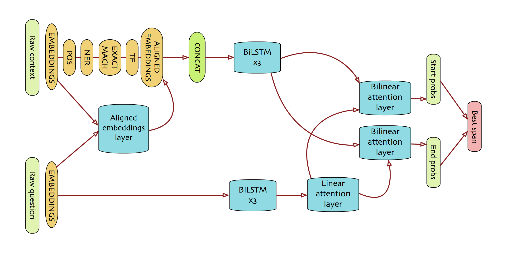

# SQuAD
Tensorflow implementation of the model for Stanford Question and Answering Dataset based on original [Facebook paper](https://cs.stanford.edu/people/danqi/papers/acl2017.pdf) and [PyTorch implementation](https://github.com/hitvoice/DrQA) of the architecture.

## Goal
The main goal of the project is to make a model, which is able to "read" the paragraph and find the answer to the question in the given context. In order to do that we feed raw contexts and questions to our model and get scores for each word being the start and the end of the answer. Then we find the best span which maximize the product of two scores. Thus, we get the most probable answer. The network comprises of several layers and schematically described below.

## Model architecture

## Usage:
0. Install python3 (version >= 3.5), wget, unzip via `apt-get` or `brew`
1. Install additional libraries via `pip3 install -r requirements.txt`. Please download english language spaCy model via `python3 -m spacy download en`.
2. In order to use preprocessed data run `python3 prepare.py`. The script will download ~1.2Gb of data. If you want to download glove embeddings and generate essential data yourself run `python3 prepare.py --preprocess yes`. Warning: estimated time ~1 hour (time consuming lemmatization). `--embeddings` arg allows to provide path to [downloaded](https://nlp.stanford.edu/projects/glove/) and unarchived embeddings (840B, 300d).
3. (Optional) Train model via `python3 train.py`. In order to change some hyperparameters refer to help: `python3 train.py -h`.
4. In order to evaluate F1 score on test dataset, use `python3 test.py`
5. In order to turn on an interactive mode, use `python3 demo.py`

### System requirements:
- External GPU (NVIDIA K80 or similar)
- 8+ Gb of RAM
- Multicore CPU (recommended)
- Ubuntu 16.04 (or higher)

## Current performance
The model was trained 7 epochs with batch size 128 and resulted with F1 score = 63. This is relatively lower than in original paper (which shows performance of 78 F1 score), so some adjustments to the architecture are to be applied and more optimal hyperparameters are to be found.
